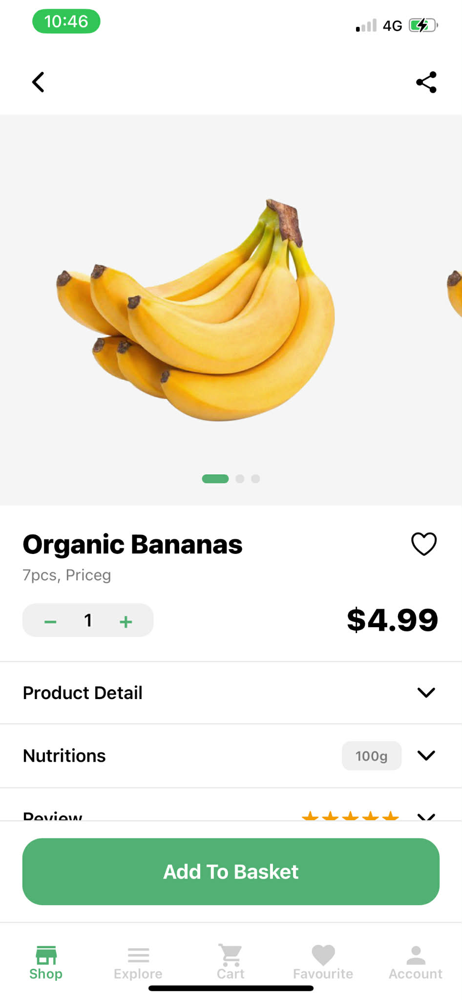
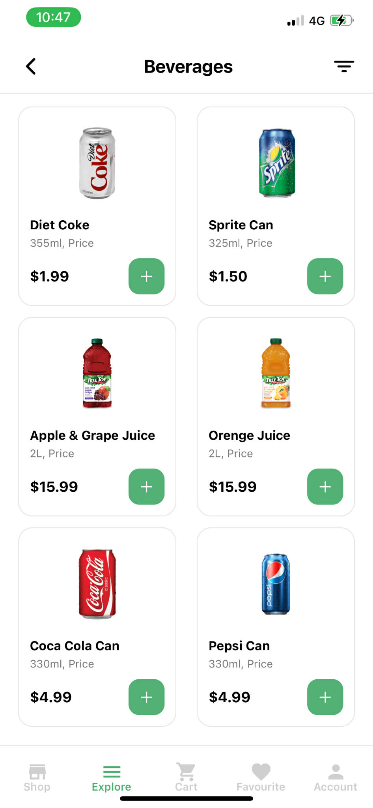
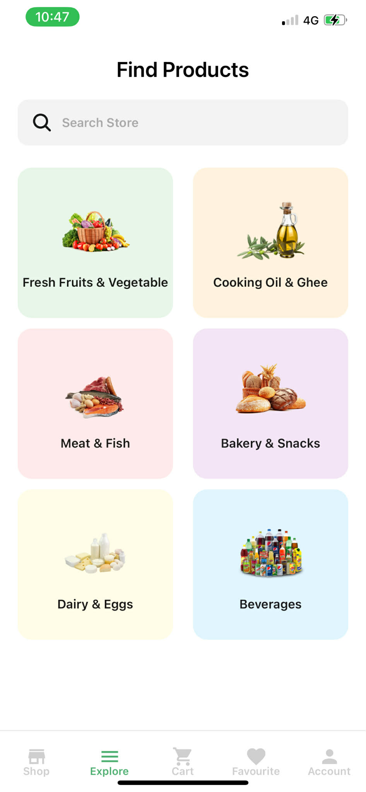
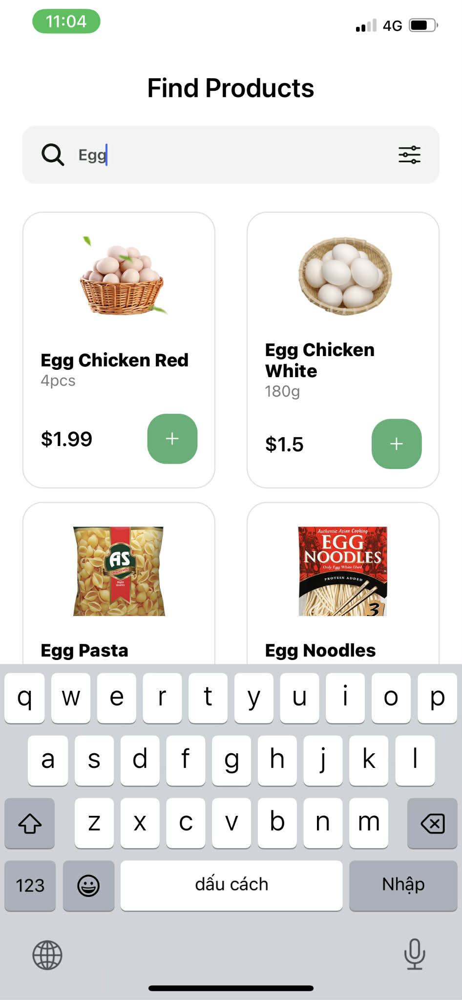
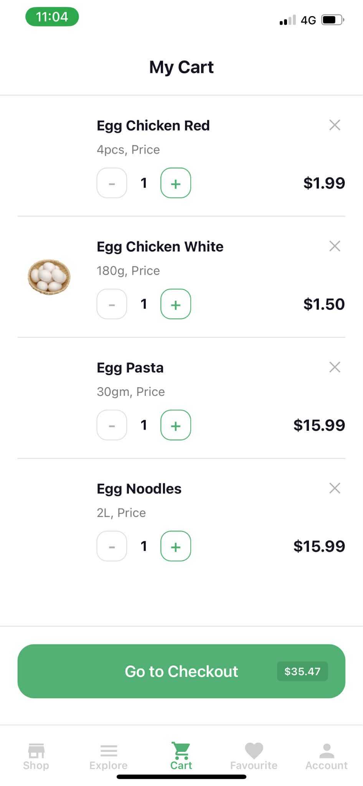
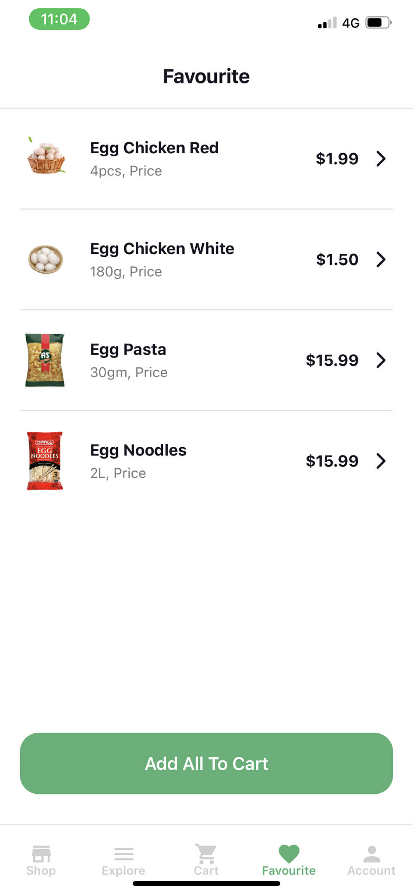
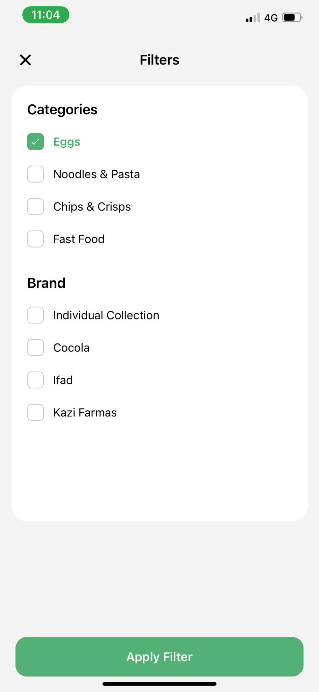

# BÀI TẬP 10/4 + 13/4 + 19/4

## Thông tin sinh viên

- **Họ và tên**: Bàn Bình Dương
- **Mã sinh viên**: 23810320382
- **Lớp**: D18CNPM4
- **Môn học**: Lập trên thiết bị di động
- **Bài tập**: Bài thực hành

---

## Hình ảnh kết quả chạy chương trình

### Giao diện màn hình

---

# Thực hành ngày 13/4

### Giao diện màn hình

---

# Thực hành ngày 19/4

### Giao diện màn hình

